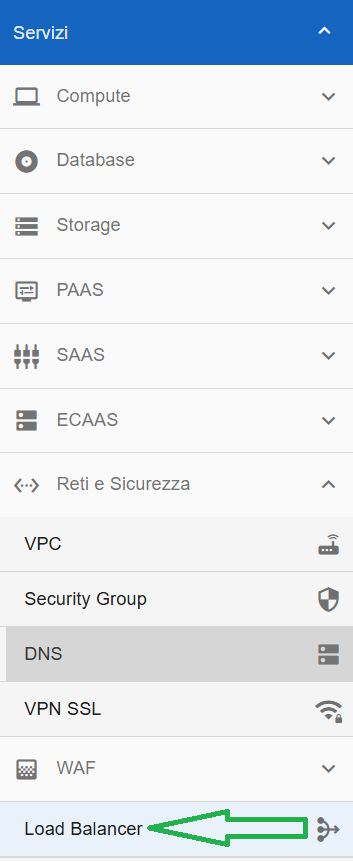
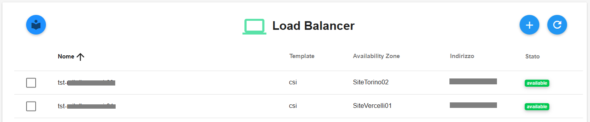

**Creare LBAAS**
================

La funzione rientra nel menù **Servizi**. I Load Balancer sono visualizzabili dalla parte
sinistra dello schermo, cliccando sulla label **Load Balancer** sotto **Reti e Sicurezza**

|

A seguito di un click su Load Balancer, il sistema popolerà la parte destra della pagina web con la lista dei Load Balancer, se presenti. 
In alternativa verrà visualizza la scritta “*Non sono presenti Load Balancer*”

|

Per la creazione del Load Balancer è possibile procedere con le seguenti due modalità:

.. toctree::
   :maxdepth: 2
 
   15.61a_Creare_LBAAS_dati_input.rst
   15.61bb_Creare_LBAAS_json.rst
