**Creare LBAAS tramite inserimento dati di input**
==================================================

1. Fare clic sul pulsante in alto a destra **Nuovo Load Balancer**:

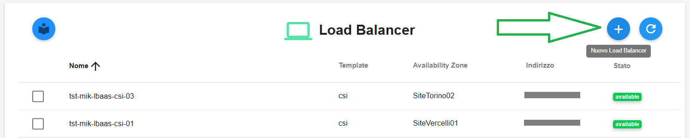

|

Comparirà la seguente schermata:

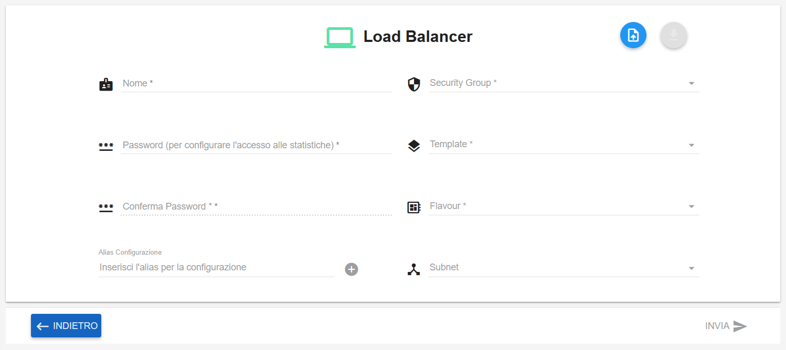

|

Compilare i campi indicati:

- inserire manualmente il nome del Load Balancer

- inserire manualmente la password

- selezionare il Security Group dal relativo menù a tendina

- selezionare il Template dal relativo menù a tendina

- selezionare il Flavour dal relativo menù a tendina

- selezionare la Subnet dal relativo menù a tendina

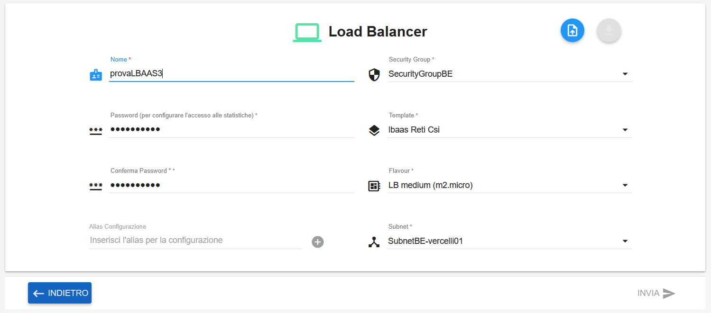

|

**Alias Configurazione**
************************

Per configurare l'**alias** inserire il nome nell'apposita casella in basso a sinistra:

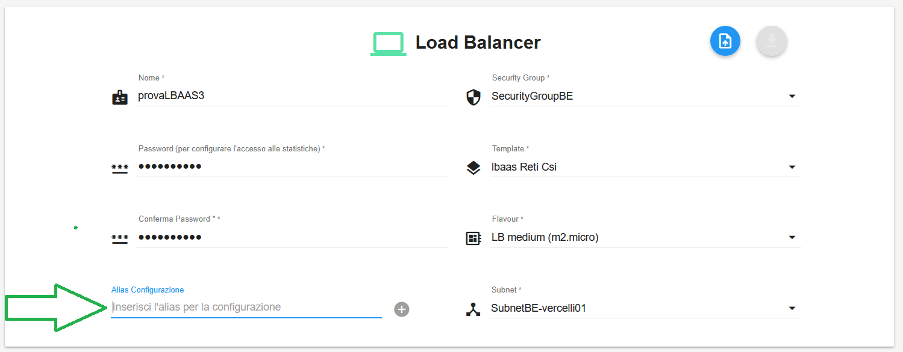

|

Il relativo tasto "+" diventerà cliccabile:

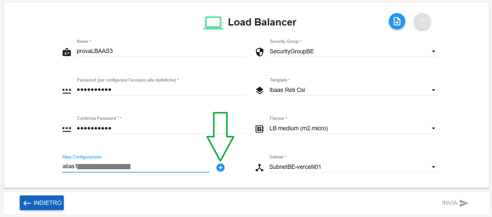

|

Cliccare tale "+" per far comparire la sezione dell'alias appena creato. Quindi cliccare sul simbolo a fianco al nome
per allargare la sezione e poter inserire i dati richiesti:

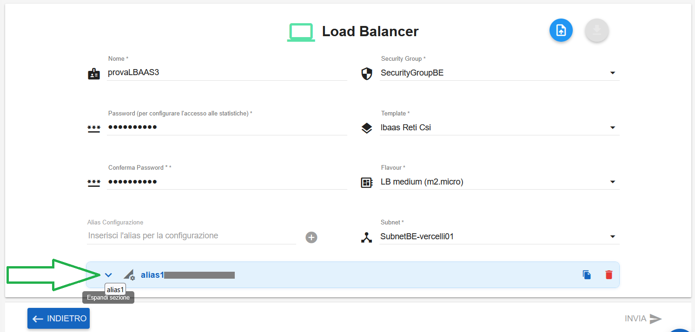

|

La sezione dell'alias espansa sarà la seguente:

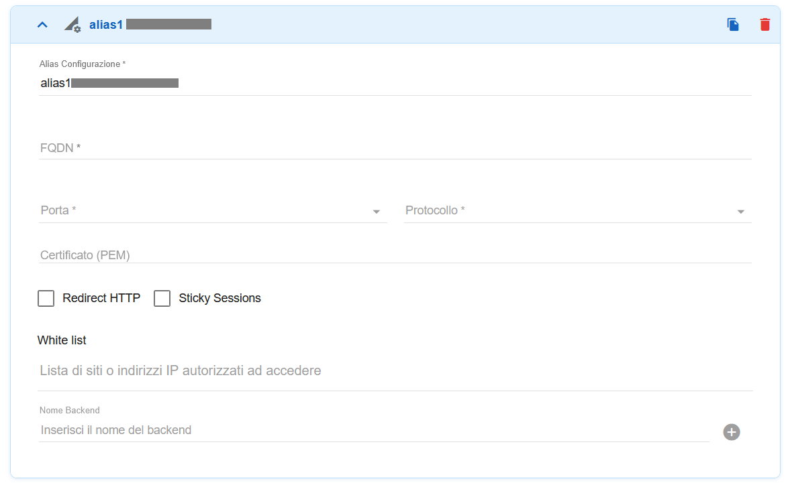

|

Compilare i campi indicati:

- inserire manualmente l'FQDN

- selezionare la porta 80 oppure 443 dal relativo menù a tendina

- selezionare il protocollo HTTP oppure HTTPS dal relativo menù a tendina

- se necessario incollare un certificato nella voce "Certificato (PEM)"

- se necessario flaggare "Redirect HTTP" oppure "Sticky Sessions"

- se necessario inserire un IP in "White list"

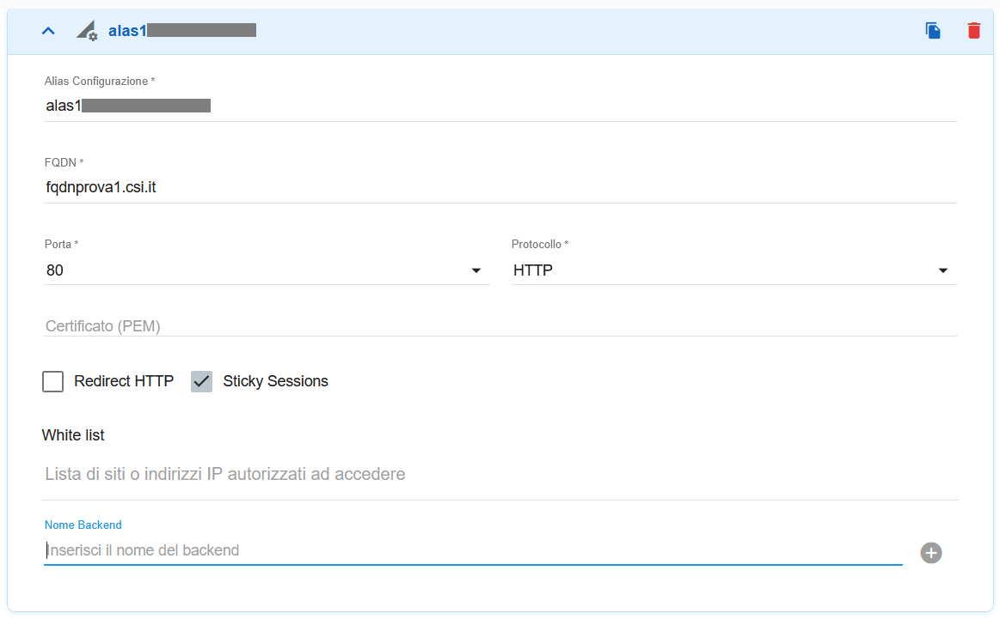

|

**Nome Backend**
****************

Per configurare il **backend** inserire il nome nell'apposita casella in basso:

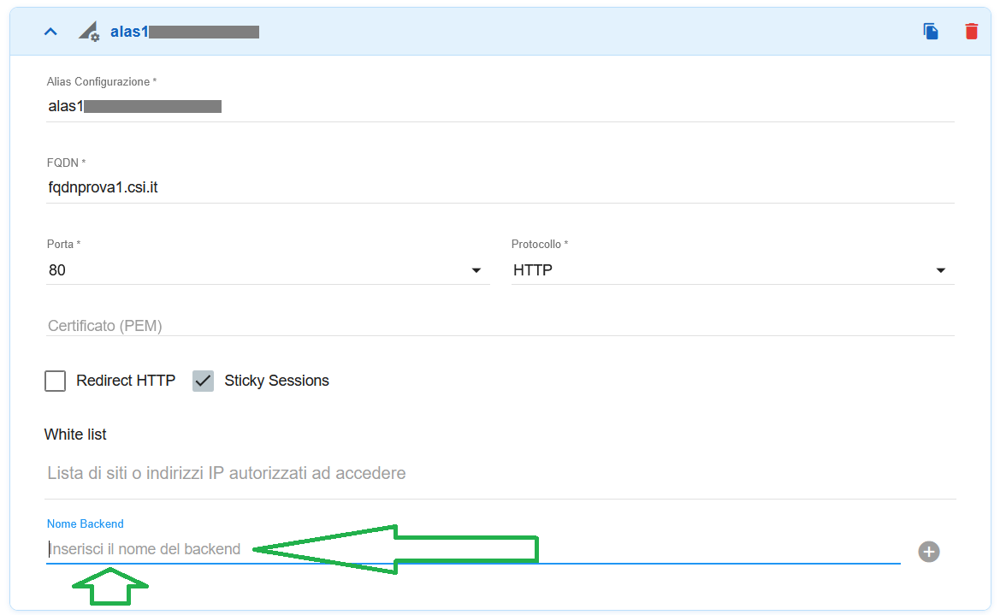

|

Il relativo tasto "+" diventerà cliccabile:

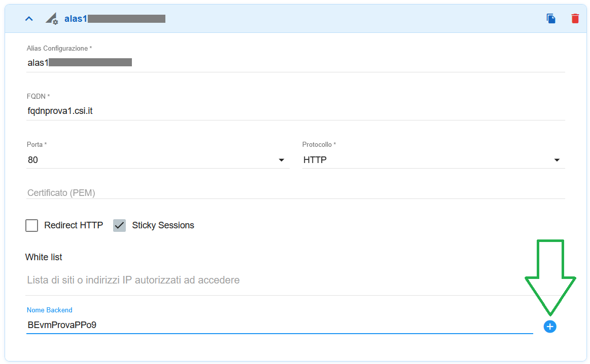

|

Cliccare tale "+" per far comparire la sezione del backend appena creato. Quindi cliccare sul simbolo a fianco al nome
per allargare la sezione e poter inserire i dati richiesti:

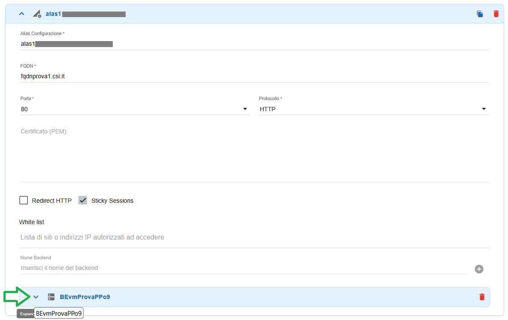

|

La sezione dell'alias espansa sarà la seguente:

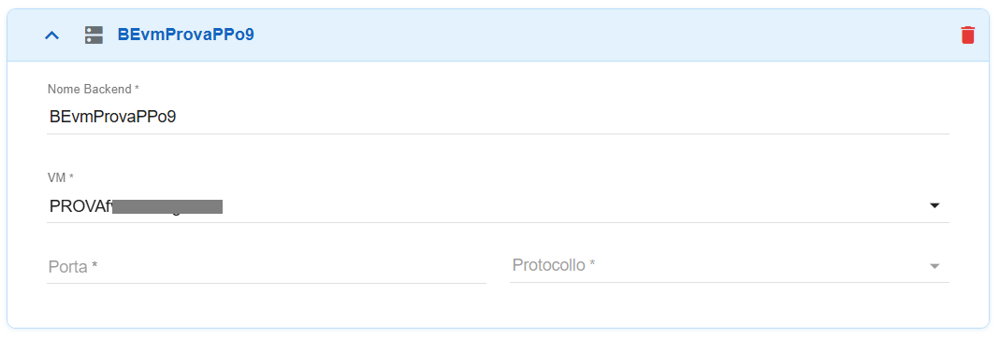

|

Compilare i campi indicati:

- selezionare la VM dal relativo menù a tendina

- inserire manualmente la porta

- selezionare il protocollo HTTP oppure HTTPS dal relativo menù a tendina

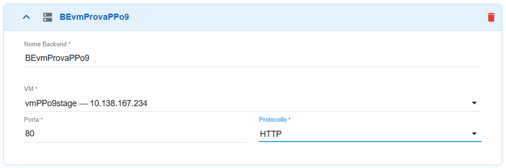

|

Ripetere tutte le operazioni descritte per ogni ulteriore alias richiesto:

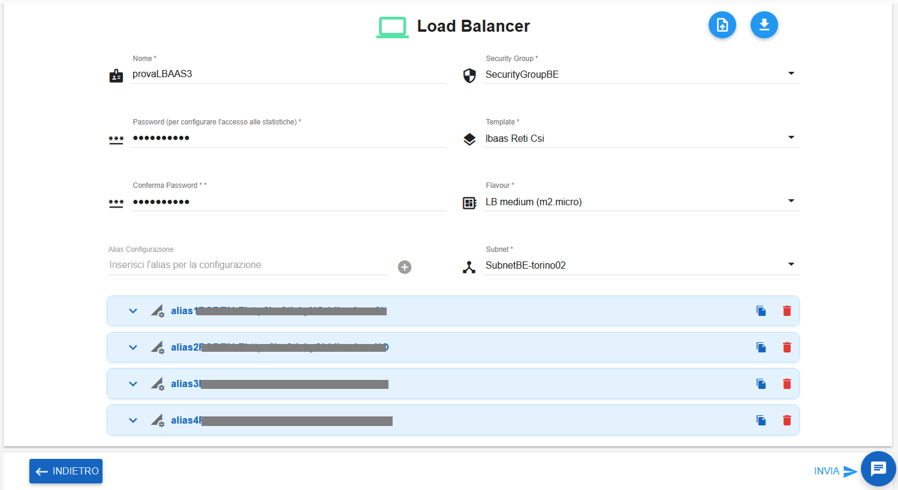

|

E' possibile utilizzare i tasti **Duplica** e **Cancella** per duplicare gli alias creati, oppure per cancellarli:

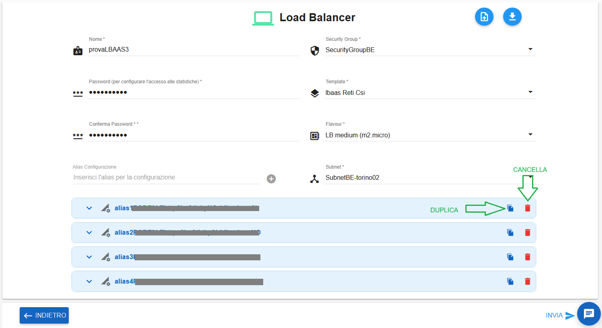

|

Al termine cliccare sul tasto in basso a destra **INVIA**

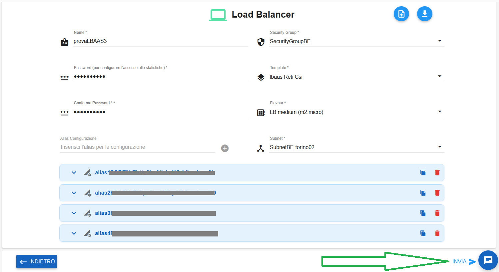

|

Comparirà il seguente messaggio di conferma:

|

Il Load Balancer in creazione assumerà il seguente stato transitorio:

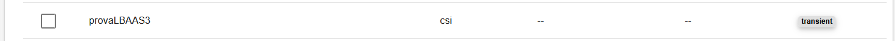

|

Al termine della creazione assumerà lo stato "available":

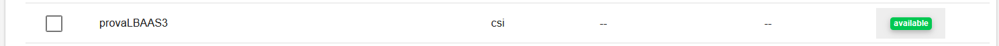
