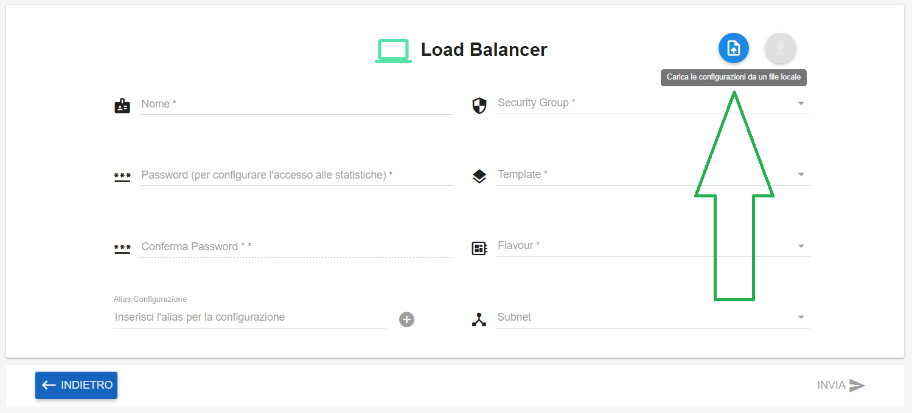
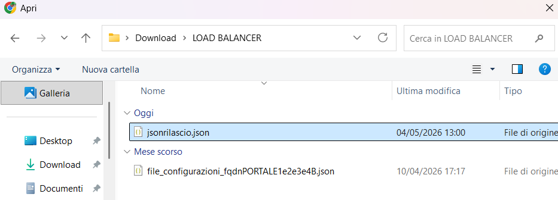
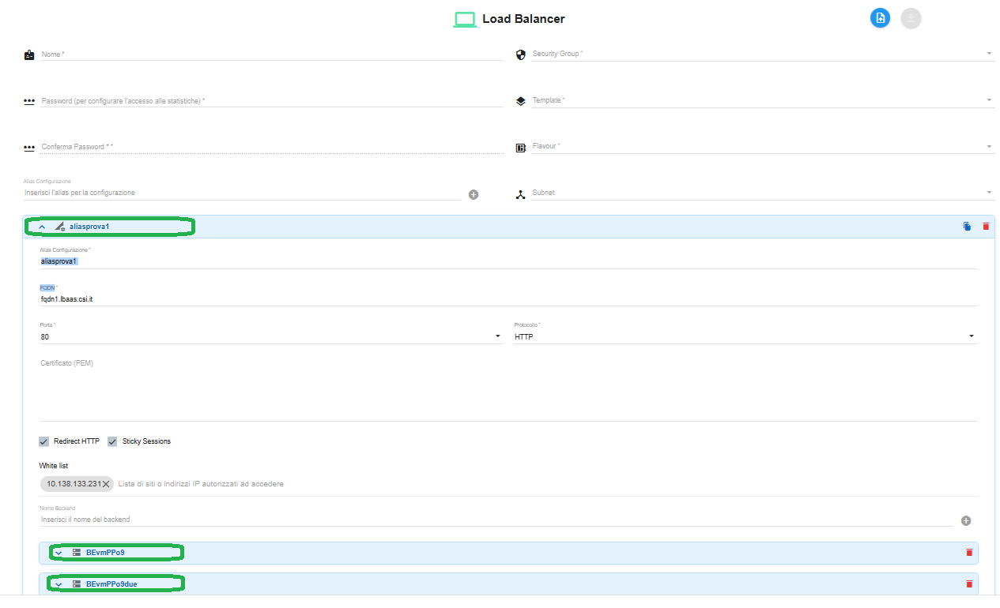
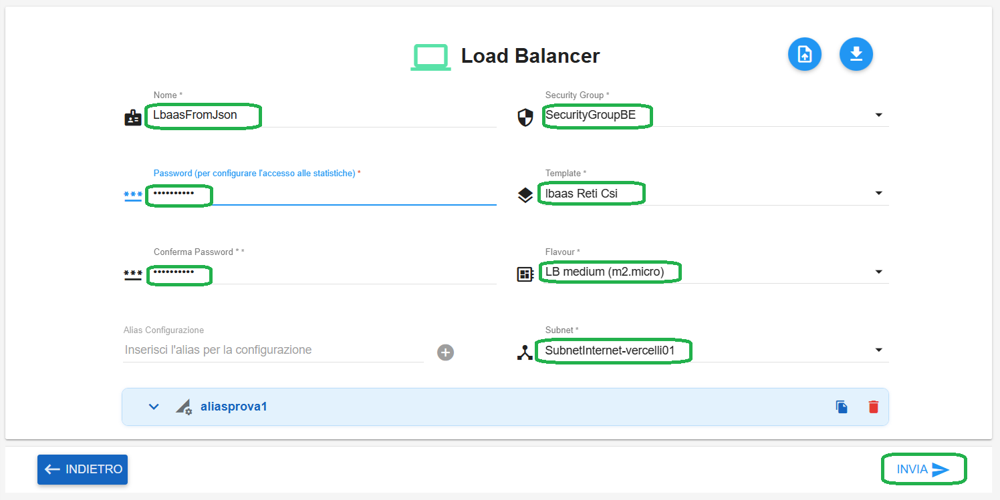

**Creare LBAAS tramite inserimento file json**
==============================================

1. Fare clic sul pulsante **+**, la cui descrizione passandoci sopra col mouse è **Nuovo Load Balancer**:

.. image:: img/15.61a_Creare_LBAAS_dati_input1.png

|

Comparirà la seguente schermata:

.. image:: img/15.61a_Creare_LBAAS_dati_input2.png

|

Cliccare sull'icona in alto a destra "**Carica le configurazioni da un file locale**":

|

Caricare il file json da risorse locali:

|

Verrà popolata la parte relativa ad **alias** e **backend**:

|

Compilare i dati mancanti, quindi cliccare su **INVIA** in basso a destra:

|

Comparirà il seguente messaggio di conferma:

.. image:: img/15.61a_Creare_LBAAS_dati_input17.png

|

Il Load Balancer in creazione assumerà il seguente stato transitorio:

.. image:: img/15.61a_Creare_LBAAS_dati_input18.png

|

Al termine della creazione assumerà lo stato "available":

.. image:: img/15.61a_Creare_LBAAS_dati_input19.png
