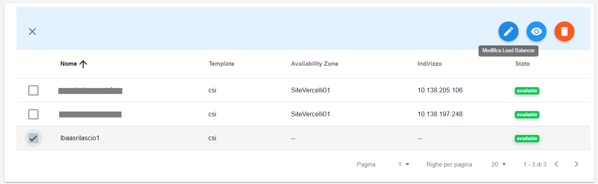
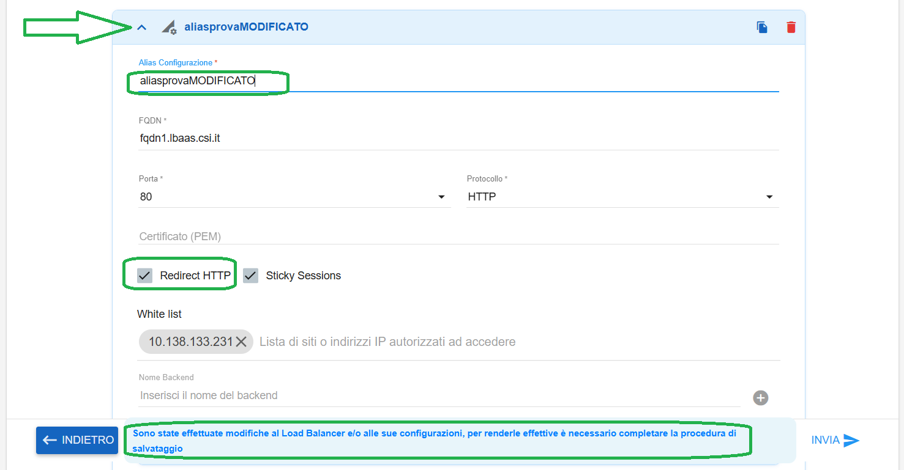

**Modificare LBAAS**
====================

Per modificare un LBAAS occorre selezionarne uno, quindi cliccare sull'icona in alto a destra "**Modifica Load Balancer**":

|

Espandere la sezione dell'alias da modificare, quindi effettuare le modifiche richieste.
Alla prima modifica effettuata, il tasto **INVIA** diventerà cliccabile ed inoltre comparirà in basso il messaggio
"**Sono state effettuate modifiche al Load Balancer e/o alle sue configurazioni, per renderle effettive è necessario completare la procedura di salvataggio**"

|

Al termine cliccare sul tasto in basso a destra **INVIA**

|

Comparirà il seguente messaggio di conferma:

|

Il Load Balancer in modifica assumerà il seguente stato transitorio:

|

Al termine della modifica assumerà lo stato "available":

