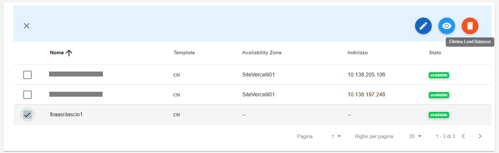
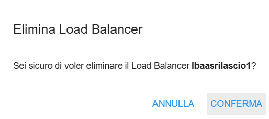

**Cancellare LBAAS**
====================

Per cancellare un LBAAS occorre selezionarne uno, quindi cliccare sull'icona in alto a destra "**Elimina Load Balancer**":

|

Comparirà la seguente richiesta di conferma di cancellazione:

|

Una volta cliccato su **CONFERMA**, comparirà il seguente messaggio di cancellazione in corso:

